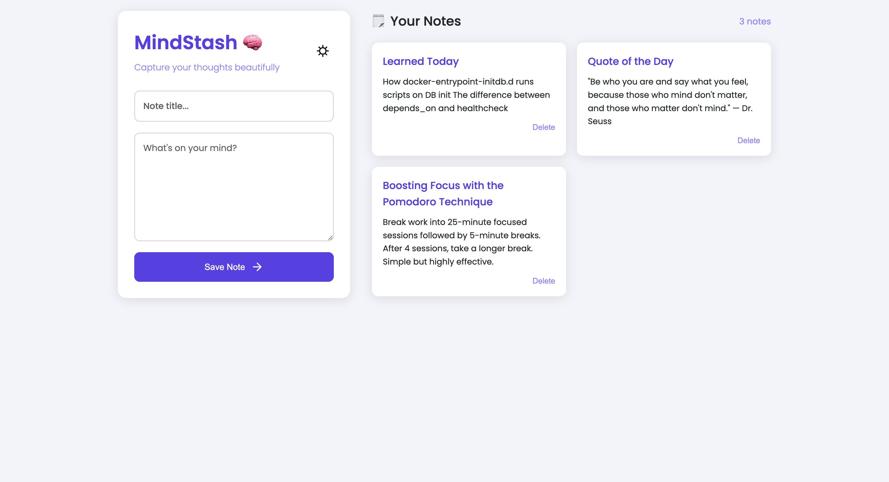
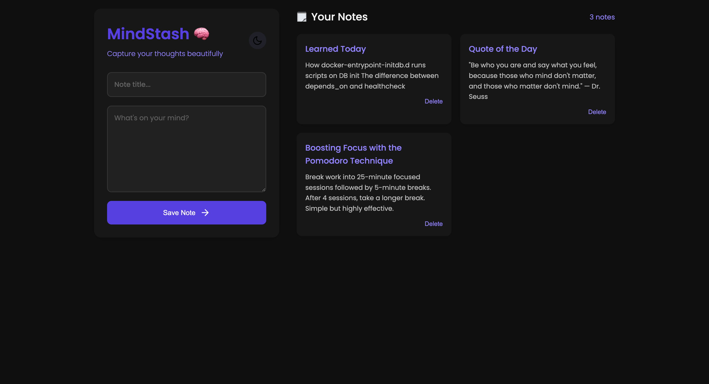

# 🧠 MindStash

A minimalistic full-stack note-taking app — like a tiny Notion or Google Keep clone — built with:

- **Backend:** Go + PostgreSQL
- **Frontend:** Vanilla HTML + CSS + JavaScript
- **DevOps:** Docker Compose

---

## 🚀 Features

- 📝 Create, view, and delete notes
- 🗄 Notes are persisted in PostgreSQL
- 📤 RESTful API with JSON support
- 🧪 Postman collection for testing

---

## 📦 Tech Stack

| Layer      | Stack                           |
|------------|---------------------------------|
| Backend    | Go (net/http), PostgreSQL       |
| Frontend   | Vanilla HTML, CSS, JavaScript   |
| Dev Tools  | Docker Compose, Postman         |

---

## 🛠️ Setup & Run Locally

### 1. 🔃 Clone the repository

```bash
git clone https://github.com/meruyert4/mindstash.git
cd mindstash
````

---

### 2. 🐳 Start with Docker Compose

```bash
docker-compose up --build
```

This will start:

* 🧠 Go backend at: [http://localhost:8080](http://localhost:8080)
* 🐘 PostgreSQL running at port `5434`

---

### 3. 🧪 API Testing with Postman (Optional)

A ready-to-use Postman collection is provided:

📁 [`/tests/MindStash.postman_collection.json`](./tests/MindStash.postman_collection.json)

Import it into Postman to test endpoints:

| Method | Endpoint      | Description     |
| ------ | ------------- | --------------- |
| GET    | `/notes`      | Get all notes   |
| POST   | `/notes`      | Create new note |
| GET    | `/notes/{id}` | Get note by ID  |
| PUT    | `/notes/{id}` | Update note     |
| DELETE | `/notes/{id}` | Delete note     |

---

## 💡 Example Notes

Here are a few sample notes you can try:

* **Title:** *Boosting Focus with the Pomodoro Technique*
  **Content:** Break work into 25-minute sessions followed by short breaks.

* **Title:** *Learned Today*
  **Content:** docker-entrypoint-initdb.d, healthcheck, React router issues.

* **Title:** *Quote of the Day*
  **Content:** "Be who you are and say what you feel..." — Dr. Seuss

---

## 🌗 Screenshots

### ☀️ Light Mode



### 🌙 Dark Mode



---

## 🧍‍♀️ Author

Built with 💜 by [@meruyert4](https://github.com/meruyert4)